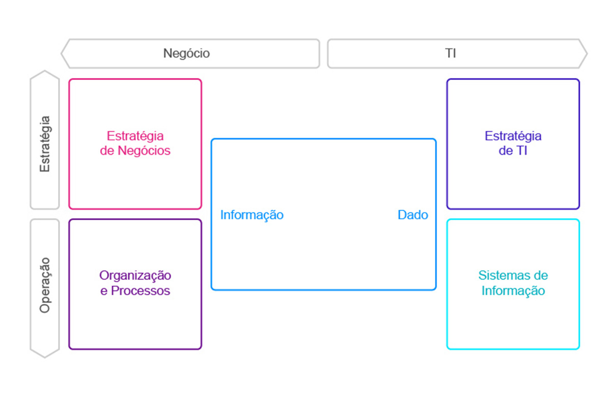

# 📊 Governança de Dados

## 🔍 Dado, Informação e Conhecimento: São a mesma coisa?

Apesar de muitas vezes serem confundidos, **dado**, **informação** e **conhecimento** são conceitos distintos — mas se complementam.

---

### 📌 **Dado**
É um **símbolo ou valor bruto** que representa algo do mundo real.

💡 **Exemplo:**  
Você está no mercado e vê um produto. O número na etiqueta (R$ 15,90) é um **dado** — ele mostra quanto o mercado quer cobrar, mas sem contexto, é apenas isso: um número.

---

### 🧠 **Informação**
Acontece quando **damos significado ao dado**, com base em nossos conhecimentos prévios.

💡 **Exemplo:**  
Você olha o preço e pensa: *"Esse produto está caro!"*.  
Pronto, o dado agora tem um **significado** para você. Isso é **informação**.

---

### 🎓 **Conhecimento**
É quando **a informação, aliada à experiência**, gera **aprendizado**.

💡 **Exemplo:**  
Você compra o produto, usa, e percebe a alta qualidade. Agora entende **por que o preço era mais alto**. Essa experiência gera **conhecimento**.

> ✅ **Resumo:**  
> - Dado → símbolo ou valor  
> - Informação → significado atribuído ao dado  
> - Conhecimento → aprendizado gerado pela experiência com a informação  

---

## ⚙️ O que é um Sistema?

Um **sistema** é um conjunto de elementos que **interagem entre si** com um objetivo comum.  
Sistemas estão por toda parte: na natureza, nas empresas, na tecnologia...

🔗 A forma como esses elementos se conectam determina o comportamento do sistema.

---

### 🔄 Funcionamento Básico de um Sistema

Um sistema costuma seguir o seguinte fluxo:

1. 🟢 **Entrada (Input):** recebe um ou mais dados
2. 🔧 **Processamento:** manipula ou transforma os dados
3. 🟣 **Saída (Output):** gera novos dados ou resultados

🔁 Em muitos casos, a **saída pode retornar como entrada**, ajustando o sistema com base em feedback (retroalimentação).

---

### 🖥️ Sistema de Informação

Em um **sistema de informação**:

- 📥 Os **dados** entram no sistema
- ⚙️ São processados por atividades de cálculo, análise ou organização
- 📤 E geram **informações** como saída

> 💡 **Dica:**  
> O que um sistema processa são **dados**, e o valor gerado depende de como eles são tratados.

---

        Ciente de que a governança corporativa traz uma direção ao envolvimento da TI com o intuito de auxiliar a organização a atingir os seus objetivos estratégicos, podemos concluir que TI é uma aliada para a estratégia do negócio, sendo um setor determinante ao sucesso da organização, seja ela do porte grande, médio ou pequeno. A TI permite uma melhoria nos processos, melhora o desempenho dos colaboradores, coleta e analisa dados para tomada de decisão, aumentado assim a necessidade de alinhamento da organização para com o seu objetivo.
      

## A final o que é Governança

        A governança é definida por várias visões de diversos autores, entre elas, a que pode ser entendida como um conjunto de redes organizadas, referindo-se à gestão de redes que se auto-organizam (MILANI; SOLINS, 2002), que norteiam como será conduzido o processo de gestão, tomada de decisões e transparência para as partes interessadas.
      

        Ou seja, é um mecânica reguladora que busca a&nbsp;<a href="https://www.voitto.com.br/blog/artigo/melhoria-continua" target="_blank">melhoria contínua</a>&nbsp;dos processos da organização, por meio da influência do conselho administrativo, acionistas, diretores e quaisquer pessoas que estejam interessadas no desempenho da organização. A governança corporativa é uma solução para a tomada de decisão mais assertiva, seguindo os parâmetros éticos e legais.
      

    

        Tudo isso faz parte do ciclo contínuo da Governança corporativa.
      

## O que é Governança de Dados??

        Governança de Dados pode ser definida como o exercício de autoridade e controle (planejamento, monitoramento e aplicação) sobre o gerenciamento de ativos de dados. Todas as organizações tomam decisões sobre os dados, independentemente de possuírem uma estrutura formal de Governança de Dados. As organizações que estabelecem um programa de Governança de Dados exercem autoridade e possuem maior controle de seus ativos, aumentando o valor que recebem deles (DAMA DMBoK®, 2020). Dentre as principais responsabilidades da área de governança, podemos citar:
      

<ul class="on-list">
        <li>
          Classificação da informação como um ativo prioritário<b> </b>de uma organização.
        </li>
        <li>
          Orquestração de pessoas, processos e tecnologias.
        </li>
        <li>
          Gestão do ciclo de vida completo da informação.
        </li>
        <li>
          Promoção de discussões sobre os dados e seus usos.
        </li>
        <li>
          Condução de definições.
        </li>
        <li>
          Orientação da conformidade com políticas e procedimentos.
        </li>
        <li>
          Comunicação e gestão de mudança.
        </li>
      </ul>

        De acordo com o DMBoX, governança de dados é um processo de tomada de decisões e responsabilidades para a jornada dos dados na organização baseada em políticas, normas e restrições. Ainda se sabe que o foco pode ser modificado de acordo com a organização, mas é certo dizer que, para ser estruturada e eficiente, é preciso que as organizações tenham bem claros suas definições, suas necessidades de gestão de dados, bem como os objetivos a serem atingidos, a partir do seu escopo de atuação. (FERNANDES; ABREU, 2012).
      

